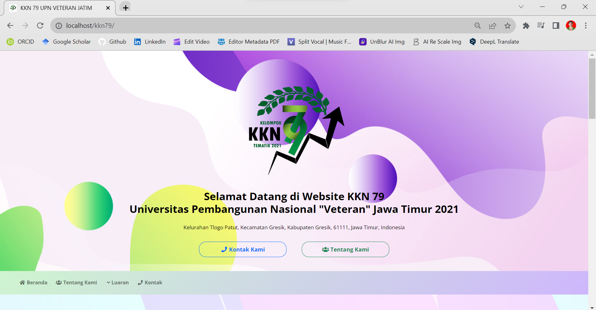
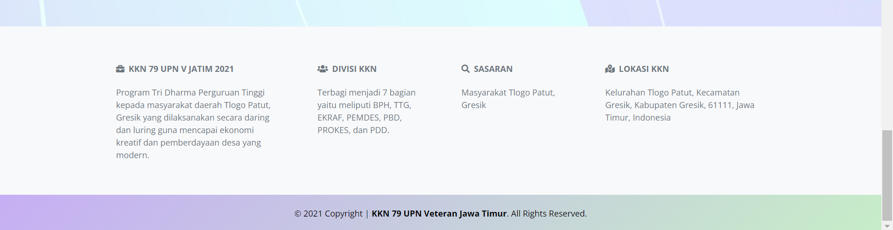
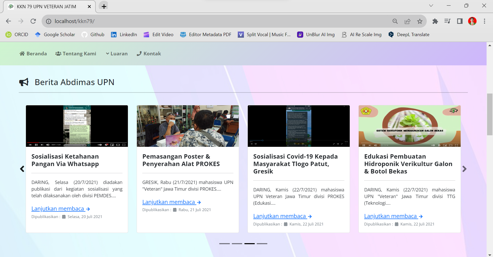
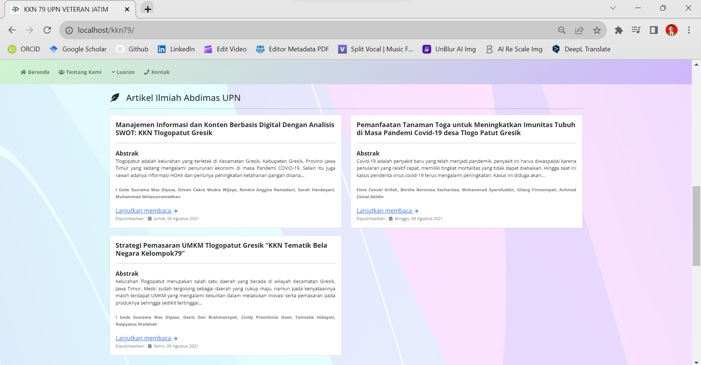
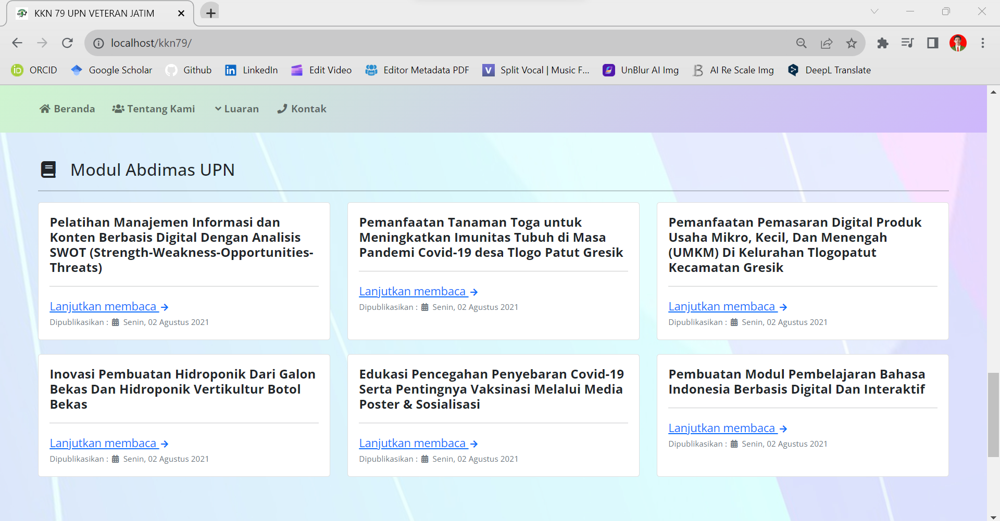
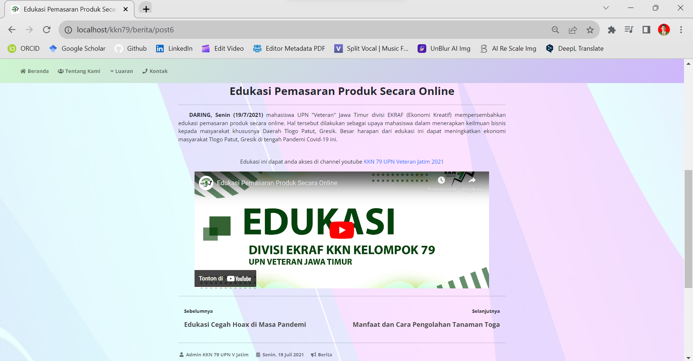
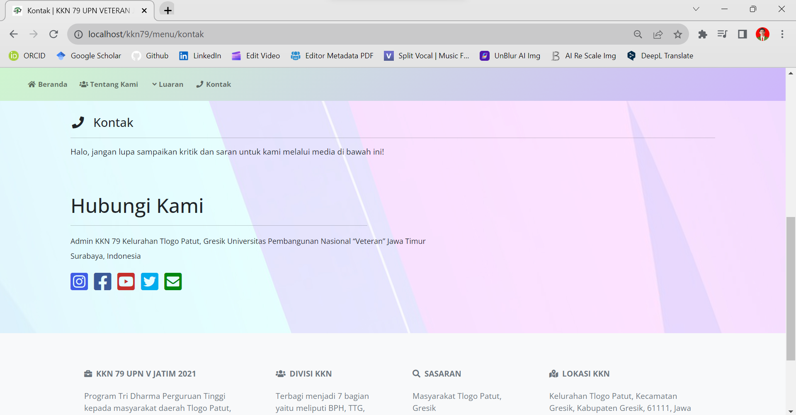

[](https://github.com/ellerbrock/open-source-badges/)
[](https://opensource.org/licenses/MIT)


# WebProfile-CI-3-KKN-79-UPN-Veteran-Jatim
It is a structured information media to make it easier for users to find out educational information related to community service. The features provided are very easy to use by users (user friendly) and can certainly save time in accessing information.

<br><br>

## Project Requirements
| Part | Description |
| --- | --- |
| Framework | Bootstrap 5, CodeIgniter 3 |
| Tools | Visual Studio Code, XAMPP (PHP Version 5+) |

<br><br>

## Download & Install
1. XAMPP with PHP version 7.4

   <table><tr><td width="810">

   ```
   https://bit.ly/XAMPP_PHP7_Installer
   ```

   </td></tr></table><br>

2. Visual Studio Code

   <table><tr><td width="810">

   ```
   https://bit.ly/VScode_Installer
   ```

   </td></tr></table>

<br><br>

## Get Started
1. Download this repository.<br><br>

2. Extract the downloaded file.<br><br>

3. Please change the directory name ``` WebProfile-CI-3-KKN-79-UPN-Veteran-Jatim ``` to ``` kkn79 ```.<br><br>

4. Move the ``` kkn79 ``` directory into the ``` htdocs ``` directory, whose details you can find out as follows: ``` C:\xampp\htdocs ```.<br><br>

5. To access the website, open ``` XAMPP ```, then start the ``` Apache ``` section.<br><br>

6. Please open your ``` browser ``` by writing: ``` localhost/kkn79/ ```.<br><br>
	
7. Enjoy [Done].

<br><br>

## Highlights
<table>
<tr>
<th width="420">Website Header section</th>
<th width="420">Website Footer section</th>
</tr>
<tr>
<td></td>
<td></td>
</tr>
</table>
<table>
<tr>
<th colspan="3">Home</th>
</tr>
<tr>
<td width="280"></td>
<td width="280"></td>
<td width="280"></td>
</tr>
</table>
<table>
<tr>
<th width="280">News</th>
<th width="280">Scientific Articles</th>
<th width="280">Learning Module</th>
</tr>
<tr>
<td></td>
<td></td>
<td></td>
</tr>
</table>
<table>
<tr>
<th width="420">About Us</th>
<th width="420">Contact</th>
</tr>
<tr>
<td></td>
<td></td>
</tr>
</table>

<br><br>

## Team Project
| N | FULL NAME | STUDY PROGRAM | ROLES |
| --- | --- | --- | --- |
| 1 | Dr. I Gede Susrama Mas Diyasa, S.T., M.T., IPU | Informatics | Supervisor |
| 2 | Devan Cakra Mudra Wijaya | Informatics | Leader |
| 3 | Heri Khariono | Informatics | Co-Leader |
| 4 | Rendra Anggita Ramadani | Architecture | Member |
| 5 | Sarah Handayani | Food Technology | Member |
| 6 | Muhammad Ikhlasurramadhan | Industrial Engineering | Member |

<br><br>

## Appreciation
If this work is useful to you, then support this work as a form of appreciation to the author by clicking the ``` ⭐Star ``` button at the top of the repository.

<br><br>

## Disclaimer
This application is the result of my work with my team and is not the result of plagiarism from other people's research or work, except those related to third party services which include: libraries, frameworks, and so on.

<br><br>

## LICENSE
MIT License - Copyright © 2021 - Devan C. M. Wijaya et al

Permission is hereby granted without charge to any person obtaining a copy of this software and the software-related documentation files to deal in them without restriction, including without limitation the right to use, copy, modify, merge, publish, distribute, sublicense, and/or sell copies of the Software, and to permit persons receiving the Software to be furnished therewith on the following terms:

The above copyright notice and this permission notice must accompany all copies or substantial portions of the Software.

IN ANY EVENT, THE AUTHOR OR COPYRIGHT HOLDER HEREIN RETAINS FULL OWNERSHIP RIGHTS. THE SOFTWARE IS PROVIDED AS IS, WITHOUT WARRANTY OF ANY KIND, EITHER EXPRESS OR IMPLIED, THEREFORE IF ANY DAMAGE, LOSS, OR OTHERWISE ARISES FROM THE USE OR OTHER DEALINGS IN THE SOFTWARE, THE AUTHOR OR COPYRIGHT HOLDER SHALL NOT BE LIABLE, AS THE USE OF THE SOFTWARE IS NOT COMPELLED AT ALL, SO THE RISK IS YOUR OWN.
